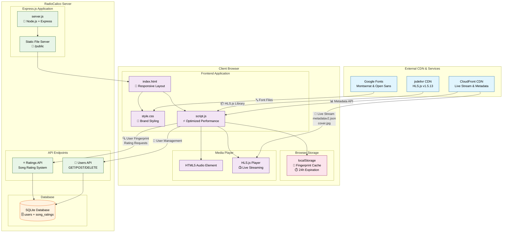
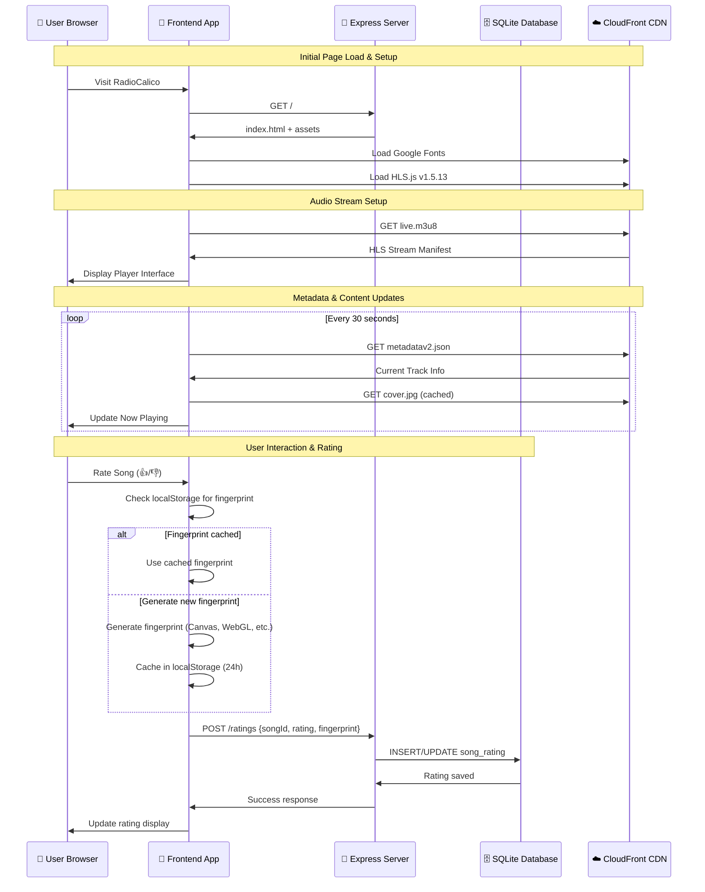
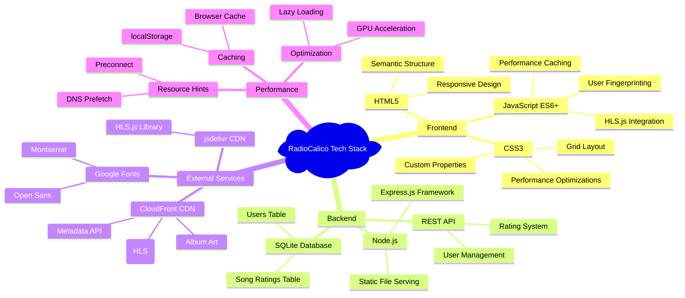

# RadioCalico Architecture Diagram

## System Architecture Overview



## Component Data Flow



## Performance Optimizations Flow

```mermaid
graph LR
    subgraph "Performance Optimizations"
        subgraph "Resource Loading"
            PRECONNECT[🔗 Preconnect Hints<br/>fonts.googleapis.com<br/>fonts.gstatic.com<br/>CloudFront CDN]
            DNSPREFETCH[🌐 DNS Prefetch<br/>jsdelivr CDN]
            SRI[🔒 Subresource Integrity<br/>HLS.js hash verification]
        end
        
        subgraph "Caching Strategy"
            FP_CACHE[💾 Fingerprint Cache<br/>24h localStorage<br/>Avoids expensive regeneration]
            IMG_CACHE[🖼️ Optimized Images<br/>ETag-based caching<br/>Lazy loading]
        end
        
        subgraph "Rendering Performance"
            GPU[⚡ GPU Acceleration<br/>transform: translateZ(0)]
            CONTAIN[📦 CSS Containment<br/>layout style paint]
            FONT_SWAP[🔤 Font Display Swap<br/>Fallback fonts]
        end
    end

    PRECONNECT -->|Faster Connection| CF
    DNSPREFETCH -->|Reduced Latency| HLSCDN
    SRI -->|Secure Loading| JS
    FP_CACHE -->|Instant Load| JS
    IMG_CACHE -->|Better Caching| CF
    GPU -->|Smooth Rendering| CSS
    CONTAIN -->|Optimized Layout| CSS
    FONT_SWAP -->|Better UX| GFONTS
```

## Technology Stack

